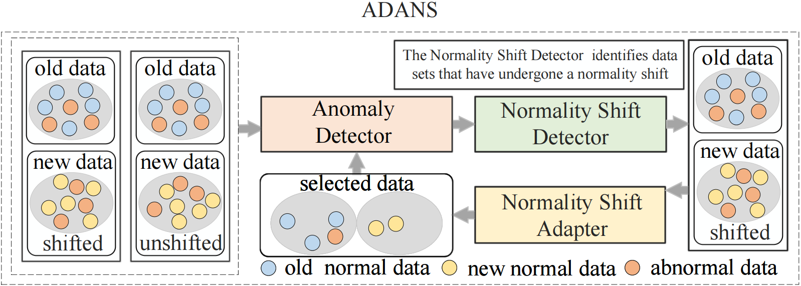
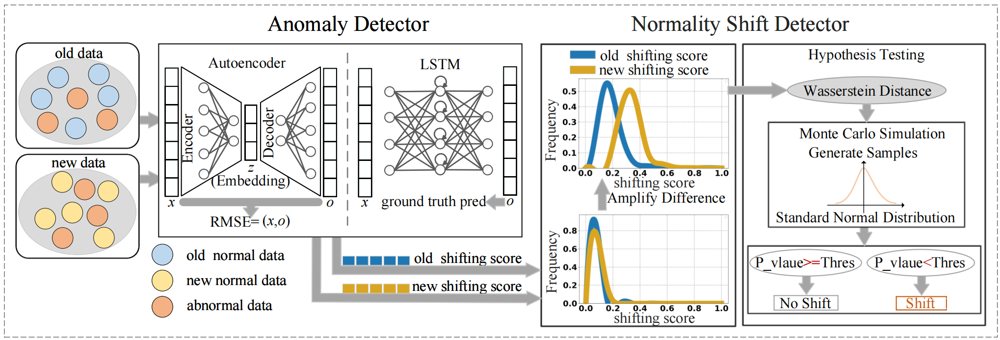
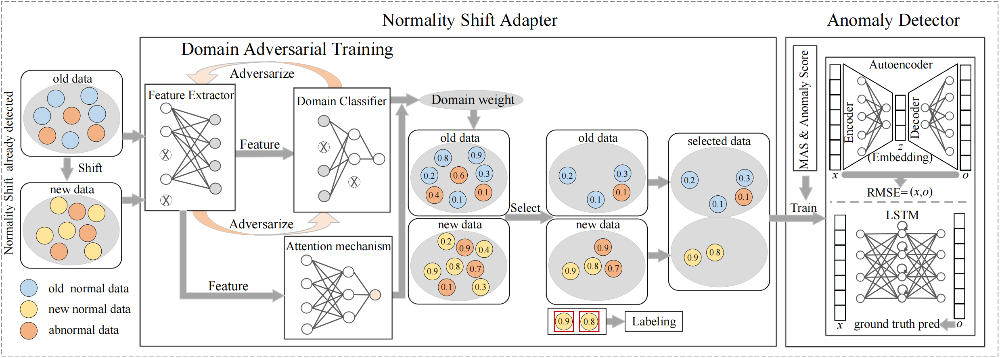

# ADANS: Adversarially Adapting Normality Shift for Anomaly Detection

Anomaly detection approaches that are based on learning compare observed behavior with patterns of normality inferred during training. This paradigm has proven to be valuable in domains such as intrusion detection, threat identification, and a host of other security-related tasks. In the dynamic contexts of the Internet of Things (IoT), where system environments evolve with the introduction of new patches, devices, or protocols, the underlying distribution of what is considered 'normal' data can shift correspondingly. Most contemporary studies have not adequately addressed the profound effects of these shifts in normality, leading to less than optimal performance when operating under an open-world presumption.

A handful of studies have attempted to address these issues by adopting a tripartite framework: detect shifts in normality, adapt to these shifts, and then proceed with anomaly detection. Despite these efforts, existing methodologies encounter two primary challenges: misidentification caused by anomalies during the shift detection phase, and the intensive labor required for labeling during the shift adaptation phase.

## Introducing ADANS

Our work presents an innovative three-stage approach, ADANS (Adversarial Normality Shift Adjustment), to robustly manage the aforementioned challenges of normality shifts in IoT environments. The approach is comprised of the following components:

1. **Normality Shift Detector**: This component enhances the ability to discern between samples within any given distribution, thus facilitating easier identification of shifts in data distributions, while also mitigating confusion that may arise from anomalous samples.

2. **Normality Shift Adapter**: Using a custom adversarial training framework, the Adapter is designed to identify and leverage representative shifted samples. This process significantly reduces the burden of labeling, making the adaptation phase more efficient.

3. **Anomaly Detector**: The final stage is tailored to generalize across normality shifts while retaining valuable knowledge acquired prior to adaptation. This ensures that the detection mechanism remains robust even as the data distribution evolves.

The flowchart of ADANS is as follows.

## Experimental Validation
overview
We have rigorously tested our method using the Kyoto 2006+ dataset to validate the efficacy of the ADANS method in addressing the normality shift problem in anomaly detection. 

## Model Architecture

Below is the schematic representation of the ADANS model:

*For detailed information, methodologies, and specific experiment results, we encourage readers to consult our paper.*
