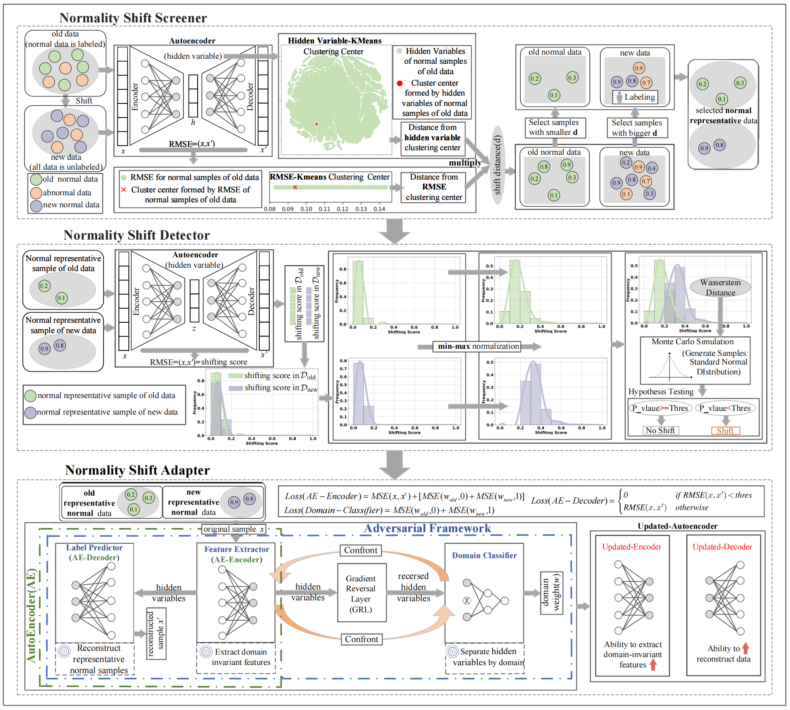

# ADANS: Adversarially Adapting Normality Shift for Anomaly Detection

Anomaly detection approaches that are based on learning compare observed behavior with patterns of normality inferred during training. This paradigm has proven to be valuable in domains such as intrusion detection, threat identification, and a host of other security-related tasks. In the dynamic contexts of the Internet of Things (IoT), where system environments evolve with the introduction of new patches, devices, or protocols, the underlying distribution of what is considered 'normal' data can shift correspondingly. Most contemporary studies have not adequately addressed the profound effects of these shifts in normality, leading to less than optimal performance when operating under an open-world presumption.

Few works tried to detect and adapt normality shifts, however, they are both prone to be misled by the sample-level shifts and ill-suited to learn the patterns of severe shifts with low manual-labor.
## Introducing ADANS

Our work presents an innovative three-stage approach, ADANS (Adversarial Normality Shift Adjustment), to robustly manage the aforementioned challenges of normality shifts in IoT environments. The approach is comprised of the following components:

1. **Normality Shift Screener**: We propose an antithetical filtering mechanism to select less but representative samples and eliminate the confusion caused by anomalous ones.

2. **Normality Shift Detector**: The latter Detector is designed to amplify the distinction of any given distribution to more effortlessly identify the shifts in the distribution level, therefore, eliminating the perturbation of sample-level shifts.

3. **Normality Shift Adapter**: An adversarial framework is tailored within a low manual-labor for the Adapter. It is able to learn different kinds of patterns from the latent (adversarial) representation of shifted samples.

The flowchart of ADANS is as follows.

## Experimental Validation

We have rigorously tested our method using the Kyoto 2006+ dataset to validate the efficacy of the ADANS method in addressing the normality shift problem in anomaly detection. 

## Model Architecture

Below is the schematic representation of the ADANS model:

*For detailed information, methodologies, and specific experiment results, we encourage readers to consult our paper.*
