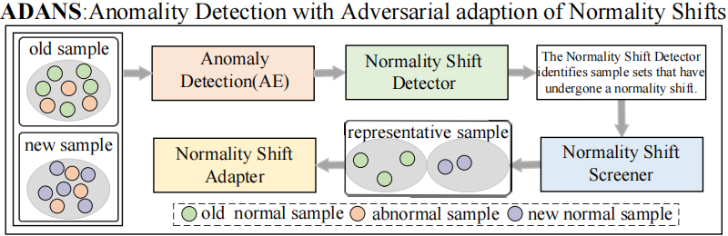

# ADANS: Adversarially Adapting Normality Shift for Anomaly Detection

Anomaly detection approaches that are based on learning compare observed behavior with patterns of normality inferred during training. This paradigm has proven to be valuable in domains such as intrusion detection, threat identification, and a host of other security-related tasks. In the dynamic contexts of the Internet of Things (IoT), where system environments evolve with the introduction of new patches, devices, or protocols, the underlying distribution of what is considered 'normal' data can shift correspondingly. Most contemporary studies have not adequately addressed the profound effects of these shifts in normality, leading to less than optimal performance when operating under an open-world presumption.

Few works tried to detect and adapt normality shifts, however, they are both prone to be misled by the sample-level shifts and ill-suited to learn the patterns of severe shifts with low manual-labor.
## Introducing ADANS

Our work presents an innovative three-stage approach, ADANS, to robustly manage the aforementioned challenges of normality shifts in IoT environments. The approach is comprised of the following components:

1. **Normality Shift Detector**: In the Detector, we designed a new distance to measure the differences in the distribution of the latent space, and reduced the interference of abnormal samples in the new data on the detection process.
2. **Normality Shift Screener**: Subsequently, the Screener will dynamically select new data and old data according to the degree of the normality shift by utilizing the distance of the Detector, laying the groundwork for the subsequent Adapter.
3. **Normality Shift Adapter**: The Adapter employs an adversarial framework that, with low manual intervention, learns diverse patterns from the latent representations of shifted samples.

The flowchart of ADANS is as follows.

## Experimental Validation

We have rigorously tested our method using the Kyoto 2006+ dataset to validate the efficacy of the ADANS method in addressing the normality shift problem in anomaly detection. 

## Model Architecture

Below is the schematic representation of the ADANS model:

*For detailed information, methodologies, and specific experiment results, we encourage readers to consult our paper.*
